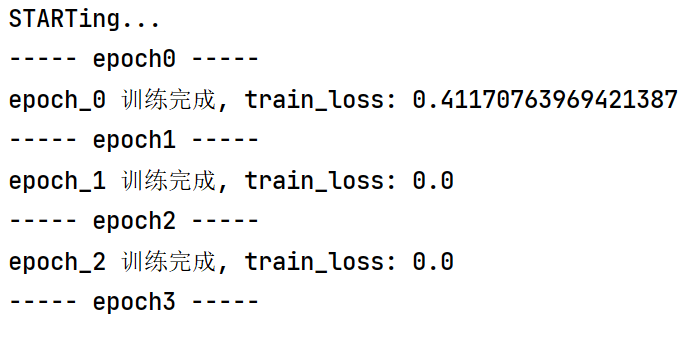

# This is a repetition of an article to learn the application of FCN in medicine.
You can read the raw article https://www.ncbi.nlm.nih.gov/pmc/articles/PMC7296847/
# Introduction
Because of lack of data, you can run the random data created, it is in the entrance of train.py
This is the result of test data . As you can see, the net's loss reamin 0. after one epoch, suggesting that the net 
successfully converges.
 